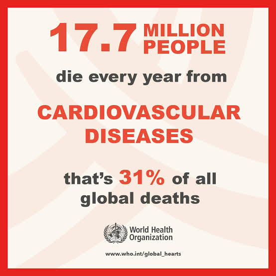

# 🫀 CardioSentinel: AI System for Guideline-Aligned Cardiovascular Disease (CVD) Management

> Bridging the **evidence–practice gap** in cardiovascular care using Retrieval-Augmented Generation and Multi-Agent System (MAS).

---

## 📌 Background

Cardiovascular diseases (CVDs) are the leading cause of death globally. An estimated 19.8 million people died from CVDs in 2022, representing approximately 32% of all global deaths. [WHO](https://www.who.int/news-room/fact-sheets/detail/cardiovascular-diseases-(cvds)#:~:text=Key%20facts,medicines%20can%20begin.)



Over the past decades, major professional bodies—such as the American College of Cardiology/American Heart Association ([ACC/AHA](https://www.acc.org/Guidelines)), the European Society of Cardiology ([ESC](https://www.escardio.org/Guidelines/Clinical-Practice-Guidelines)), and the World Health Organization ([WHO](https://www.who.int/southeastasia/activities/management-of-cardiovascular-disease))—have published **comprehensive guidelines** that define optimal diagnostic, therapeutic, and preventive strategies of cardiovascular diseases.

However, real-world clinical practice frequently fails to align with these guidelines. This persistent discrepancy, commonly referred to as the **evidence–practice gap**, results in suboptimal treatment decisions and failure to achieve recommended clinical targets for many patients with CVD. [NIH](https://pmc.ncbi.nlm.nih.gov/articles/PMC1140946/#:~:text=Abstract,such%20%E2%80%9Ctreatment%20gaps%E2%80%9D.)

---

## 🎯 The Core Problem

### Why do such gaps between **evidence and practice** exist?

A study conducted in 5 Europe countries have identified 5 most common barriers cited by physicians in implementation of these guidelines. [NIH](https://pmc.ncbi.nlm.nih.gov/articles/PMC1140946/#:~:text=Narrowing%20the%20Gap,of%20cardiovascular%20disease.)
<figure>
  
</figure>

These are **not purely medical problems** — they are **information, cognition, and coordination problems**, which makes them ideal targets for AI systems.

---

## 💡 Proposed solution

This project addresses the **evidence–practice** gap by building a modular AI system that:

* Makes clinical guidelines **instantly accessible**
* Reduces **guideline overload**
* Supports clinicians under **time pressure**
* Improves **patient adherence and follow-up**

The system is designed as a **Clinical Decision Support System (CDSS)** — it assists clinicians, **not replaces them**.

---

## 🧠 High-Level Solution Architecture

This project builds a **3-layered AI ecosystem**:

```
                   ┌─────────────────────────┐
                   │   Guideline RAG Engine   |
                   │    Evidence Retrieval   │
                   └────────────┬────────────┘
                                │
                   ┌────────────▼────────────┐
                   │   Multi-Agent System    │
                   │ Care Planning + Support │
                   └────────────┬────────────┘
                                │
                   ┌────────────▼────────────┐
                   │    Production System    │
                   │  (Deployment, UI, EHR)  │
                   └─────────────────────────┘
```

Each layer solves a **different part of the real-world barrier stack**.

---

## 🧩 Repository Structure

This is an **umbrella repository**.
The core implementations live in separate modules:

| Component                          | Purpose                                                     |
| ---------------------------------- | ----------------------------------------------------------- |
| **1. [Guideline RAG System](https://github.com/anaboset/cardio-rag-cdss)**        | Solves *guideline overload* and *lack of awareness*         |
| **2. [Multi-Agent Clinical System](https://github.com/anaboset/cvd-multi-agent-system)** | Solves *time pressure* and *patient compliance*             |
| **3. [Production System](https://github.com/anaboset/cvd-ai-production)**           | Makes the whole system usable in real clinical environments |

---

## 1️⃣ Guideline RAG System

**Independent Research Module**

📁 `./rag-guideline-engine`

### Purpose

A **Retrieval-Augmented Generation (RAG) based CDSS** that transforms static cardiovascular guidelines into a **queryable clinical reasoning system**.

### Problem It Solves

* Clinicians cannot memorize thousands of pages of guidelines
* Searching PDFs during consultation is impractical
* Guidelines are scattered, dense, and frequently updated

### What This System Does

It converts ESC/ACC/WHO guidelines into a **structured, searchable knowledge system** and generates **patient-specific, evidence-grounded recommendations**.

### Architecture Overview

                    ┌─────────────────────────────┐
                    │  Patient Clinical Summary   │     
                    │             +               |
                    |      Clinician Query        │
                    └──────────────┬──────────────┘
                                   │
                                   ▼
                    ┌─────────────────────────────┐
                    │     Query Rewriting Layer   │
                    │  (Medical Variant Generator)│
                    └──────────────┬──────────────┘
                                   │
                        Expanded Medical Queries
                                   │
                                   ▼
           ┌──────────────────────────────────────────────────┐
           │                Retrieval Funnel                  │
           │                                                  │
           │   ┌──────────────────┐      ┌──────────────────┐ │
           │   │   Vector Search  │      │   Graph Search   │ │
           │   │   (ChromaDB)     │      │    (Neo4j KG)    │ │
           │   │  "Similar Text"  │      │"Related Entities"│ │
           │   └─────────┬────────┘      └────────┬─────────┘ │
           │             │                        │           │
           │             └───────────┬────────────┘           │
           │                         ▼                        │
           │              Candidate Guideline Chunks          │
           └─────────────────────────┬────────────────────────┘
                                     │
                                     ▼
                      ┌─────────────────────────────┐
                      │   Context-Aware Reranker    │
                      │ (Patient-Specific Scoring)  │
                      └──────────────┬──────────────┘
                                     │
                           Top-K Evidence Snippets
                                     │
                                     ▼
                      ┌─────────────────────────────┐
                      │   Guardrailed LLM Generator │
                      │  (Evidence-Constrained CDSS)│
                      └──────────────┬──────────────┘
                                     │
                                     ▼
                      ┌─────────────────────────────┐
                      │  Guideline-Aligned Output   │
                      │  + Citations + Transparency │
                      └─────────────────────────────┘


---

## 2️⃣ Multi-Agent Clinical Support System

**Built on top of the RAG Engine**

📁 `./multi-agent-clinical-system`

### Purpose

Moves beyond *information retrieval* to **care coordination and reasoning**, using multiple specialized AI agents.

### Problem It Solves

Even when guidelines are known:

* Clinicians lack time for deep planning
* Patients struggle with adherence
* Care is fragmented

### System Architecture

                                 ┌──────────────────────────┐
                                 │   Clinician / System     │
                                 │  Query + Patient Data    │
                                 └────────────┬─────────────┘
                                              │
                                              ▼
                                 ┌──────────────────────────┐
                                 │    Orchestrator Agent    │
                                 │ (Task Routing + Control) │
                                 └────────────┬─────────────┘
                                              │
                 ┌────────────────────────────┼────────────────────────────┐
                 ▼                            ▼                            ▼
         ┌─────────────────┐        ┌──────────────────┐         ┌────────────────────┐
         │ Guideline Agent │        │ Clinical Reasoner│         │ Patient Comm Agent │
         │ (Evidence Query)│        │ (Care Planning)  │         │ (Education Output) │
         └───────┬─────────┘        └─────────┬────────┘         └─────────┬──────────┘
                 │                            │                            │
                 │                            ▼                            │
                 │                 ┌──────────────────────┐                │
                 │                 │ Medication Agent     │                │
                 │                 │(Therapy Optimization)│                │
                 │                 └─────────┬────────────┘                │
                 │                           │                             │
                 └─────────────┬─────────────┴───────────┬─────────────────┘
                               ▼                         ▼
                       ┌────────────────┐       ┌────────────────────┐
                       │ Risk Agent     │       │ Adherence Agent    │
                       │ (Risk Scoring) │       │ (Follow-up Logic)  │
                       └────────────────┘       └────────────────────┘


### What This Layer Adds

* Longitudinal care planning
* Medication adjustment logic
* Patient-specific lifestyle advice
* Automated follow-up suggestions

This layer tackles:

✔ Time pressure
✔ Complex decision-making
✔ Patient compliance

---

## 3️⃣ Production System

**Turning Research into Real-World Infrastructure**

📁 `./production-system`

### Purpose

Transforms the AI system into a **clinically deployable platform**.

### Key Areas

* API infrastructure
* Security & privacy design
* Logging and audit trails
* Monitoring and evaluation
* UI for clinicians
* Integration pathways (future EHR compatibility)

### Why This Matters

Most AI healthcare projects fail not because of models —
they fail at **deployment, safety, and usability**.

This module ensures:

* Clinical transparency
* Traceability of recommendations
* Safe system behavior

---

## 🚧 Development Roadmap

| Phase   | Focus                                   |
| ------- | --------------------------------------- |
| Phase 1 | Build and validate Guideline RAG Engine |
| Phase 2 | Develop Multi-Agent Clinical Layer      |
| Phase 3 | Integrate agents with RAG               |
| Phase 4 | Production architecture & API           |
| Phase 5 | Evaluation & validation                 |

---

## ⚠️ Scope and Limitations

* This is a **decision support system**, not an autonomous clinician
* Recommendations are limited to available guideline evidence
* Clinical outcome improvements require real-world validation

---

## 🌍 Significance

This project demonstrates how **RAG + Multi-Agent AI** can be responsibly used in healthcare to:

* Reduce cognitive overload
* Improve evidence access
* Support structured clinical reasoning
* Enhance patient engagement

It targets the **information and cognition bottlenecks** at the heart of the evidence–practice gap.

---

## 🧪 Research Contributions

This project contributes to:

* Medical RAG architectures
* Multi-agent clinical reasoning systems
* Faithfulness-constrained medical LLMs
* AI for evidence-based medicine

---

## 🔗 System Modules

| Module | Description |
|--------|-------------|
| [Guideline RAG Engine](https://github.com/anaboset/cardio-rag-cdss) | Evidence retrieval system |
| [Multi-Agent Clinical System](https://github.com/anaboset/cvd-multi-agent-system) | Care reasoning & coordination |
| [Production System](https://github.com/anaboset/cvd-ai-production) | Deployment infrastructure |

---

## 📜 License

All components of this system are released under the MIT License unless stated otherwise. See individual repositories for details.

---
